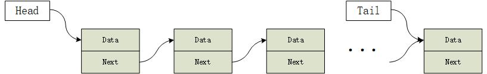
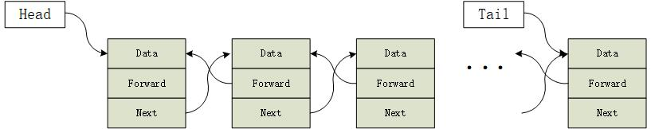
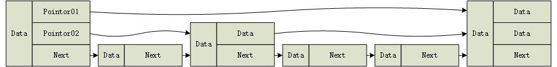

# 链表 Chain Table

## 什么是链表

链表是数据结构中最基础也是非常重要的一种。通过链表可以更灵活更有效的来组织和管理数据

链表是由一个一个的数据节点构成的链式结构的数据，它在物理内存中的存储是不连续的、无顺序的。

## 链表有什么用

链表的不连续性，在使用链表时可以随意的增加、插入、删除、查找、修改链表中的任一节点。如此可以更有效的使用有限的内存资源

链表与其它数据结构相结合可以使程序变得易于实现，例如，链表与栈相结合可以方便的实现文本编辑器中的标签功能等。

## 链表的种类

链表有多种组织方式：单向链表，双向链表，循环链表，跳跃链表等等。根据不同的场景可以选用不同的链表结构。

单向链表：



    单项链表是一种最基本的链表结构，它的每一个节点主要由数据部分和链表指针两个部分构成，通过每一个节点中的链表指针指向下一个节点地址来组织链表结构。

双向链表：



    双向链表与单向链表不同的地方即是节点中除了包含一个指向下一个节点的指针外，还存在一个指向上一个节点的指针，这样的设计可以在一定程度上提高链表的访问效率。

跳跃链表：



    跳跃链表结构稍微复杂，它根据数据的特点来组织节点。在跳跃链表中并不是每个节点都只有指向前一个或下一个节点的指针。在跳跃链表中，每个一定的距离会有一个特殊的节点，这个节点记录了多个节点的指针。

    在组织跳跃链表的时候通常会对链表中的数据节点以某种规则进行排序，例如，数字数据按照升序或降序进行排序等。跳跃链表可以很大程度上提高链表的效率，是一种以空间换时间的方法。

## 链表的实现

链表中的节点至少包含两个部分：

>1 数据部分
>2 链表指针

链表的连接就是通过链表指针实现的，链表中的每一个节点的指针中都存放有下一个节点的地址。因此只需要知道链表中首个节点的指针就可以访问链表中所有的节点。

接下来通过C语言来实现一个存储整形数据的单向链表。

1. 定义节点数据结构

```
typedef struct _NodeInt{
    int num;
    struct _NodeInt *next;
}NodeInt;
```

NodeInt就是我们定义的一个单向链表的数据结构，有了这个数据结构我们就可以实现链表的操作了：

向链表中添加一个节点：

```
NodeInt *list_int = (NodeInt*)malloc(sizeof(NodeInt));
list_int->num = 2;
list_int->next = NULL;
```

至此我们的链表中有了第一个节点，那么接下来我们继续添加第二个节点：

```
list_int->next = (NodeInt*)malloc(sizeof(NodeInt));
list_int->next->num = 4;
list_int->next->next = NULL;
```

现在我们似乎已经实现了我们所说的单向链表的结构，但很明显，这样的方式很不方便，如果我们需要在第n个节点后边添加新元素的话，那么就需要写n个next来实现，这样实在是太麻烦了。更不要说对它进行查找、删除等操作了。

因此，我们需要实现一些函数来对我们的链表进行操作。链表的基本操作包括添加，删除，查找，下边将实现这三个方法。
### 初始化一个链表

为了方便管理链表，定义一个新的结构体来保存一个单向链表的基本信息

```
typedef struct _ChainTableInt{
    NodeInt *head;
    NodeInt *tail;
}ChainTableInt;
```

链表结构体中有两个节点指针，一个指向链表的首个节点，另一个指向节点的末尾节点。

下边的函数实现了初始化一个空链表。

```
ChainTableInt* initTableList()
{
    ChainTableInt *pCTableInt = (ChainTableInt*)malloc(sizeof(ChainTableInt));
    pCTableInt->head = pCTableInt->tail = NULL;
    return pCTableInt;
}
```

空链表中应该保证没有任何节点。

### 增加节点

增加节点是指在链表的尾端添加一个节点，过程比较简单

1. 向系统申请内存资源
2. 将数据写入第1步中申请资源的内存中
3. 将这个节点的next置为NULL
4. 将链表中的末尾节点next指针指向新的末尾节点地址
5. 将链表中的末尾节点记录改为新的末尾节点

需要注意的是如果链表为空链表，新加入的节点将既是首节点也是末尾节点

```
int addNode(ChainTableInt *pCTableInt, int num)
{
    // 首先申请内存空间
    NodeInt *pnode = (NodeInt*)malloc(sizeof(NodeInt));
    pnode->num = num;
    pnode->next = NULL;
    // 判断以下情况
    if(pCTableInt->head->next == NULL)
    {
        // 此时链表是一个空链表，链表的首尾均为新加入的节点
        pCTableInt->head = pCTableInt->tail = pnode;
    }
    else
    {
        // 此时链表不为空链表，首先将尾部节点指针指向新加入的节点，然后将尾节点改为新加入的节点
        pCTableInt->tail = pCTableInt->tail->next = pnode;
    }
    return 0;
}
```

### 删除节点

删除节点是将链表尾部的节点删除，可分为4步进行

1. 查找到链表的末尾节点的前一个节点
2. 将末尾节点的内存释放
3. 将链表末尾节点指针指向第1步中找到的节点地址作为末尾地址
4. 将末尾节点的next指针置为NULL

此外还需要当心链表为空和链表中仅有一个节点的情况。

```
int deleteNodeFromTail(ChainTableInt *pCTableInt)
{
    NodeInt *pnode = pCTableInt->head;
    if(pCTableInt == NULL)
    {
        // 链表未经初始化
        return -1;
    }
    else if(pCTableInt->head == NULL)
    {
        // 链表为空链表
        return -1;
    }
    else if(pCTableInt->head->next == NULL)
    {
        // 链表中仅有一个元素
        free(pCTableInt->head);
        pCTableInt->head = NULL;
    }
    else{
        // 链表中有多个元素
        while(pnode->next != pCTableInt->tail)
        {
            pnode = pnode->next;
        }
        free(pCTableInt->tail);
        pCTableInt->tail = pnode;
        pnode->next = NULL;
    }
    return 0;
}
```

### 查找一个节点

查找节点是一个比较容易产生歧义的问题，例如本例中查找节点有两种方式，第一，查找链表中数据num相等的节点；第二，查找一个确定的节点地址。

第一种查找，可能存在多个节点具有相同的值；

第二种查找，则是一个唯一确定的节点。

因此在设计查找方法的时候需要根据实际需要来进行设计，为简单起见，本例中仅实现对链表中首个num值匹配的查找方法。

```
NodeInt* findNum(ChainTableInt *pCTableInt, int num)
{
    NodeInt* pnode = pCTableInt->head;
    while(pnode != NULL && pnode->num != num)
    {
        pnode = pnode->next;
    }
    return pnode;
}
```

至此，实现了一个链表的创建，添加，删除，查找四个操作。

